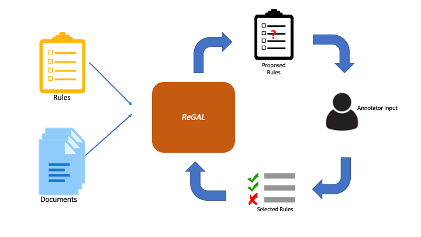

# REGAL: Rule-Guided Active Learning for Semi-Automated Weak Supervision

REGAL is a framework for interactive, weakly supervised text classification. 
Starting with a small number of seed rules, REGAL uses transformers to extract 
high-quality labeling functions (LFs) directly from text.  
This transforms the problem of creating LFs to one of simply accepting or 
rejecting LFs created by the model.  This enables users to quickly create a
set of weak labelers for text without the need of manual LF development.  

For more details on how REGAL works, please [check out our paper][https://openreview.net/forum?id=FZDPu3JLEPg]!

<div>
  
</div>


## Getting Started
* [Install REGAL's dependencies](#installation) 
* [Download the data][https://figshare.com/articles/dataset/regal_data_zip/19090253] used in the paper from figshare
* [Run REGAL][#usage] on one of the datasets in our paper or train a new model on your own dataset

## Installation


1. Clone a copy of REGAL's repository

```
git clone https://github.com/pathology-dynamics/regal.git
cd regal
```

2. Create a conda environment with REGAL's dependencies
```
conda env create -f environment.yml
conda activate regal
```

## Usage
To run the models described in the paper, first [download the preprocessed data][https://figshare.com/articles/dataset/regal_data_zip/19090253].

Assuming you have a [properly formatted dataset][#use-your-own-dataset] located at `data/yelp.pt can then run REGAL from the command line as follows:
```
python run_rpn.py --data_path temp/yelp.pt --num_classes 2 --batch_size 128 --warmup_epochs 0 --max_iters 1000 --max_rule_iters 1000 --refresh --oracle --model_no 1 --output yelp --autoeval --max_rule_length 1 --min_lf 2 
```

## Use your own dataset
To use your own dataset, simply format your data as a dictionary as described below and save using `torch.save`:
```
{
    'train': {
        'text': [
            'Text of first train example.',
            'Text of second train example.',
           ...
        ]
        'labels': torch.LongTensor([0,1,1,0,2,...])
    }

    'valid': {
        'text': [...]
        'labels': torch.LongTensor([...])
    }

    'test': {
        'text': [...]
        'labels': torch.LongTensor([...])
    }

    'class_names': {
        0: 'class_0_name',
        1: 'class_1_name',
        ...
    }

    'rule_keywords': {
        0: ['keyword_1', 'keyword_2', 'keyword_3'],
        1: ['keyword_4', 'keyword_5', 'keyword_6'],
    }
}
```
*Note that due to the identifiability constraints of Snorkel, you will need to have at least 3 keywords for each class

To train REGAL on this data, simply run:
```
python run_rpn.py --data_path /PATH/TO/YOUR/DATASET --num_classes NUM_CLASSES --OPTIONS
```

To see a full list of options for running your model, simply run `python run_rpn.py --help`


<!-- ## Citation -->